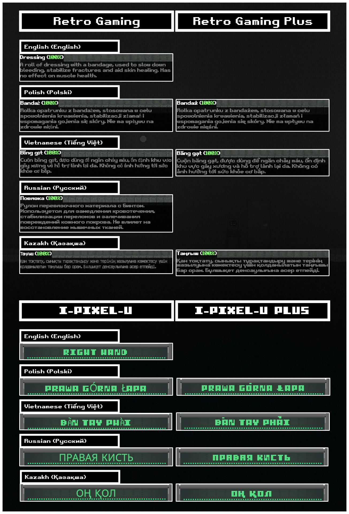

# XTMP Fallback Fonts for Casualties: Unknown




These fonts are intended to be metrically-compatible fallback fonts for Casualties: Unknown, where most fonts used in the game have extended language support, covering a ton more languages. For more info about the languages supported, check [here](https://github.com/Catterio/xtmp-casualtiesunknown-fallback-fonts#supported-languages).

You will need to have XTMPi (formerly XTMP) already set up in order to add fallback fonts into the game.

Though, feel free to use the fonts for other purposes as well.


## Usage guide/Instruction

1. Install the [BepInEx](https://github.com/BepInEx/BepInEx/releases) plugin. (Refer to this [KrokMP installation tutorial](https://youtu.be/heVTSZc2a20) for instructions on how to set up BepInEx.)
2. Create a folder named `XTMP` inside `BepInEx/plugins`.
3. Download the zip file from [XTMPi repository](https://github.com/EnineStuxnet/XTMPi/releases/latest). Within the zip file, copy **only** the files `XTMP.dll` and `XTMP.pdb` inside `BepInEx/plugins/XTMP`.
4. Return to your newly-created `XTMP` folder (from step 2) and paste in the two above files.
5. Download the `fonts.zip` zip file ([here](https://github.com/Catterio/xtmp-casualtiesunknown-fallback-fonts/releases/tag/Main/latest)) and extract the contents in the same folder.
6. Write a configuration file (using a text-writing program like Notepad) as provided below, then save it as a `.ini` file (e.g.: `configuration.ini`) in the `XTMP` folder.
```
# GLOBAL FALLBACK FONT
Retro Gaming Plus


# RETRO GAMING-TARGETTED FALLBACK FONT
[Retro Gaming]
Retro Gaming Plus

[Retro GamingPix]
Retro Gaming Plus

[Retro Gaming SDF]
Retro Gaming Plus


# HEALTH PANEL REPLACEMENT FONT
[I-pixel-u -> I-pixel-u Plus]

# SURVIVOR NOTE FONT REPLACEMENT 
[ExperimentIEatCrayons -> ExperimentIEatCrayons Plus]
[MilkyOnlyYou -> MilkyOnlyYou Plus]
[DuneOrange_B -> DuneOrange_B Plus]
```
  > If you wish to customise the fallback/replacement font, refer to the [configuration syntax](https://github.com/EnineStuxnet/XTMPi#configuration-syntax).


  At the end, your `BepInEx/plugins/XTMP` directory should look something like this:
```
BepInEx/plugins/XTMP/
├── configuration.ini
├── fonts/
│   ├── DuneOrange_B Plus.ttf
│   ├── ExperimentIEatCrayons Plus.ttf
│   ├── I-pixel-u Plus.ttf
│   ├── MilkyOnlyYou Plus.ttf
│   └── Retro Gaming Plus.ttf
├── XTMP.dll
└── XTMP.pdb
```
 If done correctly, C:U should now appropriately use the fallback fonts as intended the next you start the game.


## Supported languages

105 total languages are supported by all five fonts:

> **Latin script:** Afrikaans, Albanian, Asu, Basque, Bemba, Bena, Breton, Catalan, Chiga, Colognian, Cornish, Croatian, Czech, Danish, Dutch, Embu, English, Esperanto, Estonian, Faroese Filipino, Finnish, French, Friulian, Galician, Ganda, German, Gusii, Hungarian, Icelandic, Inari Sami, Indonesian, Irish, Italian, Jola-Fonyi, Kabuverdianu, Kalaallisut, Kalenjin, Kamba, Kikuyu, Kinyarwanda, Latvian, Lithuanian, Lower Sorbian, Luo, Luxembourgish, Luyia, Machame, Makhuwa-Meetto, Makonde, Malagasy, Maltese, Manx, Meru, Morisyen, Northern Sami, North Ndebele, Norwegian Bokmål, Norwegian Nynorsk, Nyankole, Oromo, Polish, Portuguese, Quechua, Romanian, Romansh, Rombo, Rundi, Rwa, Samburu, Sango, Sangu, Scottish Gaelic, Sena, Serbian (Latin), Shambala, Shona, Slovak, Slovenian, Soga, Somali, Spanish, Swahili, Swedish, Swiss German, Taita, Teso, Turkish, Upper Sorbian, Uzbek (Latin), Vietnamese, Volapük, Vunjo, Walser, Welsh, Western Frisian, Zulu.
  
> **Cyrillic script:** Belarusian, Bosnian, Bulgarian, Chechen, Macedonian, Russian, Serbian (Cyrillic), Ukrainian.

Additional languages supported by Retro Gaming Plus and I-pixel-u Plus: 

> **Latin script:** Aghem, Akan, Asturian, Bafia, Basaa, Duala, Ewe, Ewondo, Fulah, Igbo, Kabyle, Kako, Koyraboro Senni, Kwasio, Langi, Lingala, Luba-Katanga, Masai, Metaʼ, Mundang, Nama, Ngiemboon, Ngomba, Nuer, Prussian, Tachelhit, Tasawaq, Yangben, Yoruba, Zarma.
  
> **Cyrillic script:** Azerbaijani, Ossetic, Sakha, Uzbek (Cyrillic).
  
> And **Greek**.

*This was taken from running the fonts through [fontdrop.info's Language Report](https://fontdrop.info/#/languages?darkmode=true).* 


## Credits

Expanding language support for all fonts shown here was done by Catterio.

I-pixel-u Plus was made by Catterio (independent of _I pixel u_).

Retro Gaming was made by Daydarius, [published on dafont.com](https://www.dafont.com/retro-gaming.font).

I pixel u was made by rodrigosrtz, [first published on FontStuct.com](fontstruct.com/fontstructions/show/1146323/i_pixel_u).

i eat crayons was made by FontPanda, [published on dafont.com](https://www.dafont.com/i-eat-crayons.font).

Only You was made by Gratisan; [published on dafont.com](https://www.dafont.com/only-you-2.font).

Orange Book was made by Remedy667; [published on dafont.com](https://www.dafont.com/orange-book.font).
